# Screen Blur - 화면 가리개

Windows용 화면 블러 효과 유틸리티입니다. 화면의 특정 영역을 반투명하게 흐리게 만들어 민감한 정보를 가리거나 집중력을 높일 수 있습니다.

## ✨ 주요 기능

- **간편한 가리개 생성**: 드래그 앤 드롭으로 화면의 원하는 영역을 선택
- **항상 위 표시**: 가리개가 다른 모든 창 위에 표시됨
- **고정 기능**: 가리개의 위치와 크기를 고정하여 실수로 이동되지 않도록 방지
- **트레이 아이콘**: 백그라운드에서 실행되며 필요할 때만 GUI 표시
- **설정 저장**: 트레이 최소화 옵션 등 사용자 설정 자동 저장

## 🎯 사용 사례

- 화상 회의나 스트리밍 중 개인 정보 보호
- 작업 중 특정 영역에 집중하기 위한 시각적 차단
- 발표나 시연 시 민감한 정보 가리기

## 📋 시스템 요구사항

- Windows 10/11
- Python 3.8 이상 (소스 실행 시)
- 메모리: 50MB 이상

## 🚀 빠른 시작

### 실행 파일 사용

1. [Releases](../../releases) 페이지에서 최신 버전 다운로드
2. `ScreenBlur.exe` 실행
3. 트레이 아이콘 더블클릭 또는 우클릭 메뉴에서 GUI 열기
4. "새 가리개 생성" 버튼 클릭
5. 가리고 싶은 영역을 드래그 앤 드롭

### 소스 코드 실행

```bash
# 저장소 클론
git clone https://github.com/yourusername/ScreenBlur.git
cd ScreenBlur

# 가상 환경 생성 및 활성화
python -m venv .venv
.venv\Scripts\activate  # Windows

# 의존성 설치
pip install -r requirements.txt

# 실행
python main.py
```

## 🎮 사용 방법

### 가리개 생성

1. 메인 GUI에서 "새 가리개 생성" 클릭
2. 메인 모니터에서 가리고 싶은 영역을 드래그
3. 가리개가 생성되고 메인 GUI가 다시 표시됨

### 가리개 조작

**메인 GUI에서:**
- ☑️ 가리개 고정: 체크 시 새로 생성되는 가리개가 고정됨
- 🔴 모든 가리개 닫기: 현재 활성화된 가리개 제거

**가리개 우클릭 메뉴:**
- 새 가리개 생성
- 고정 (위치 & 크기)
- 이 가리개 닫기
- 프로그램 종료

**마우스 조작:**
- 왼쪽 클릭 + 드래그: 가리개 이동 (고정되지 않은 경우)

## 🏗️ 프로젝트 구조

```
ScreenBlur/
├── main.py                 # 애플리케이션 진입점
├── python/                 # 소스 코드
│   ├── main_window.py     # 메인 GUI
│   ├── viewport.py        # 가리개 위젯
│   ├── selection_overlay.py # 영역 선택 오버레이
│   ├── interaction_handler.py # 마우스 입력 처리
│   ├── system_tray.py     # 트레이 아이콘
│   ├── settings.py        # 설정 관리
│   └── utils.py           # Windows 블러 API
├── icon.ico               # 애플리케이션 아이콘
├── build.py              # 빌드 스크립트
└── requirements.txt      # 의존성 목록
```

## 🔧 빌드

PyInstaller를 사용하여 실행 파일을 생성합니다:

```bash
# 가상 환경 활성화
.venv\Scripts\activate

# 빌드 스크립트 실행
python build.py
```

빌드된 파일은 `release/` 폴더에 생성되며, 이전 버전은 자동으로 `release/archive/`에 보관됩니다.

## 🔄 동작 흐름

```mermaid
graph TD
    A[앱 시작] --> B[메인 GUI 표시]
    B --> C[새 가리개 생성 클릭]
    C --> D[메인 GUI 숨김]
    D --> E[SelectionOverlay 표시]
    E --> F[영역 드래그]
    F --> G[가리개 생성]
    G --> H[메인 GUI 재표시]
    H --> I{사용자 조작}
    I -->|우클릭| J[컨텍스트 메뉴]
    I -->|드래그| K[가리개 이동]
    I -->|닫기| L[가리개 제거]
    J --> I
    K --> I
    L --> H
```



## ⚙️ 설정

설정은 `%APPDATA%\ScreenBlur\settings.json`에 자동으로 저장됩니다.

**사용 가능한 설정:**
- `minimize_to_tray`: 메인 GUI 닫기 시 트레이로 최소화 여부 (기본값: true)

## 🛠️ 기술 스택

- **Python 3.x**: 메인 프로그래밍 언어
- **PySide6 (Qt6)**: GUI 프레임워크
- **ctypes**: Windows Blur API 호출
- **PyInstaller**: 실행 파일 패키징

## 📝 알려진 제한사항

- 가리개 초기 생성은 **메인 모니터**에서만 가능 (생성 후 다른 모니터로 이동 가능)
- Windows 전용 (DWM Blur API 사용)

## 🤝 기여

버그 리포트, 기능 제안, Pull Request를 환영합니다!

1. Fork the Project
2. Create your Feature Branch (`git checkout -b feature/AmazingFeature`)
3. Commit your Changes (`git commit -m 'Add some AmazingFeature'`)
4. Push to the Branch (`git push origin feature/AmazingFeature`)
5. Open a Pull Request

## 📄 라이선스

이 프로젝트는 MIT 라이선스 하에 배포됩니다.

## 🙏 감사의 말

- PySide6/Qt 프레임워크
- Windows Desktop Window Manager (DWM) API
